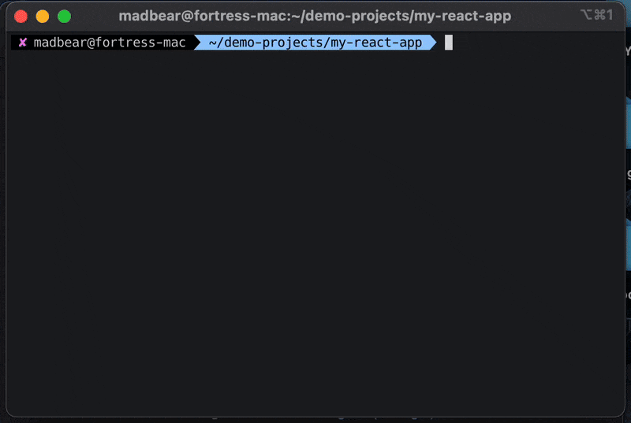

# Skytunnel.run

Expose local servers to the internet without installation, signup, and free forever. Skytunnel is an open-source alternative to ngrok and serveo.

## Quick Start

```bash
ssh -R 443:localhost:8080 skytunnel.run
```
Replace `8080` with your local port number.

if you want to specify your own subdomain use the following command
```bash
LC_DOMAIN=yourdomain ssh -R 443:localhost:8080 skytunnel.run
```
Replace `yourdomain` with preferred name

## Features

- **No Installation Required** - Just use SSH, which is already installed on most systems
- **No Signup Needed** - Start using immediately without registration
- **Free Forever** - No hidden costs or premium features
- **Zero-knowledge TLS** - Encrypted traffic through secure tunnels
- **Secure WebSocket Support** - Compatible with WebSocket connections
- **Deterministic Domain Names** - Get the same domain name every time (based on pubkey)
- **Birng your own subdomain** - Use custom subdomain via environment variables
- **Open Source** - Contribute or self-host your own instance

## How It Works

Skytunnel uses a NodeJS application to handle web subdomain requests, proxying them to TCP forwarded connections opened on a custom SSH server implemented using the ssh2 npm library.

## FAQ

### How does it differ from serveo.net?
Skytunnel was heavily inspired by serveo. However, serveo currently receives limited support.

### I got an error or cannot connect. What should I do?
As a non-commercial project, issues may occur. The project is under active development. Please open an issue on GitHub if you encounter problems.

### Who is this for?
Skytunnel is built by developers for developers. It's designed to simplify local development and project prototyping. Not recommended for production use.

## Development

Contributions are welcome!


